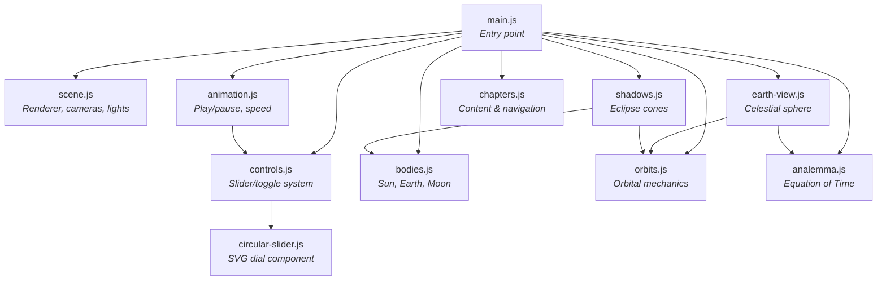

# Architecture

This document describes the technical implementation of SpaceBalls: how the modules fit together, how the orbital math works, how the 3D scene is structured, and how user interactions flow through the system.

---

## Module Dependency Graph



**Key principles:**

- `main.js` is the only module that imports from all others. It wires everything together.
- No module imports from `main.js` (except `chapters.js` which imports the `controls` instance).
- `orbits.js` is the shared math library — both `earth-view.js` and `shadows.js` depend on it.
- `circular-slider.js` is a self-contained UI component with no scene dependencies.

---

## Three.js Scene Graph

The 3D scene uses two visibility-toggled groups to implement the dual-view system:

```
scene
├── ambientLight
├── sunLight (PointLight at origin)
├── starfield (Points)
├── spaceViewGroup (visible in Space View)
│   ├── sun (Group: sphere + glow sprite)
│   ├── earthOrbitGroup (Group, positioned on orbit)
│   │   ├── earth (Group: mesh + axis line + observer dot)
│   │   ├── moonGroup (Group, visible from chapter 3)
│   │   │   └── moon (Group: mesh)
│   │   ├── moonOrbitLine (Line)
│   │   └── nodeLine (Line)
│   ├── earthOrbitLine (Line)
│   ├── eclipticPlane (Mesh: RingGeometry)
│   └── shadowCones (Group)
│       ├── moonShadowCone (Mesh: ConeGeometry)
│       ├── earthShadowCone (Mesh: ConeGeometry)
│       ├── penumbraCone (Mesh: ConeGeometry)
│       └── eclipseIndicator (Sprite)
└── earthViewGroup (visible in Earth View)
    └── earthView (Group)
        ├── celestialSphere (Mesh: SphereGeometry, BackSide)
        ├── horizonRing (Mesh: TorusGeometry)
        ├── belowHorizon (Mesh: half-sphere, BackSide)
        ├── compassGroup (Group: N/E/S/W sprites + zenith)
        ├── sunDot (Mesh + glow sprite)
        ├── moonDot (Mesh: MeshStandardMaterial)
        ├── sunTrail (Line: dashed)
        ├── moonTrail (Line: dashed)
        ├── multiTrails (Group: solstice/equinox arcs)
        ├── refCircles (Group: meridian)
        ├── riseMarker (Mesh: diamond)
        ├── setMarker (Mesh: diamond)
        ├── analemmaTrail (Group: line + dot markers)
        ├── sunLight (DirectionalLight)
        └── ambientLight (AmbientLight)
```

**View switching** (`scene.js → switchView()`): toggles `spaceViewGroup.visible` and `earthViewGroup.visible`, swaps the active camera, and enables/disables OrbitControls.

---

## Orbital Mechanics (`orbits.js`)

### Kepler's Equation Solver

The core challenge: given a day of the year and an eccentricity, compute where Earth is on its elliptical orbit.

**Step 1 — Mean Anomaly (M):**

The mean anomaly increases linearly with time. It represents where the planet *would* be on a circular orbit:

```
M = 2π × (dayOfYear - perihelionOffset) / daysPerYear
```

The perihelion offset (~3 days) accounts for Earth's perihelion occurring around January 3.

**Step 2 — Eccentric Anomaly (E) via Newton-Raphson:**

Kepler's equation relates M and E:

```
M = E - e × sin(E)
```

This is transcendental — no closed-form solution exists. We solve iteratively:

```javascript
function solveKepler(M, e) {
    let E = M;  // Initial guess
    for (let i = 0; i < 20; i++) {
        const dE = (E - e * sin(E) - M) / (1 - e * cos(E));
        E -= dE;
        if (|dE| < 1e-10) break;
    }
    return E;
}
```

The Newton-Raphson update `dE = f(E)/f'(E)` converges quadratically. For Earth's eccentricity (0.0167), 3-4 iterations suffice. Even at the maximum slider value (e=0.8), convergence happens within ~10 iterations.

**Step 3 — True Anomaly (ν):**

The true anomaly is the actual angle from perihelion:

```
ν = 2 × atan2(√(1+e) × sin(E/2), √(1-e) × cos(E/2))
```

**Step 4 — Orbital Radius:**

```
r = a × (1 - e²) / (1 + e × cos(ν))
```

where `a` is the semi-major axis (`EARTH_ORBIT_RADIUS`). The position in the ecliptic plane (y=0) is then `(r cos ν, 0, r sin ν)`.

### Sun Position on the Celestial Sphere

`computeSunAltAz()` converts the Sun's position to altitude-azimuth coordinates as seen by an observer on Earth's surface:

1. **Solar declination** — the Sun's angular distance from the celestial equator, caused by axial tilt:
   ```
   δ = tilt × sin(2π × (dayOfYear - equinoxOffset) / daysPerYear)
   ```

2. **Hour angle** — how far the Sun has moved from the meridian due to Earth's rotation:
   ```
   H = 2π × (timeOfDay - 12) / 24
   ```

3. **Altitude** (elevation above horizon):
   ```
   sin(alt) = sin(lat) × sin(δ) + cos(lat) × cos(δ) × cos(H)
   ```

4. **Azimuth** (compass bearing from North):
   ```
   az = atan2(-cos(δ) × sin(H), sin(δ) × cos(lat) - cos(δ) × sin(lat) × cos(H))
   ```

The `altAzToSpherePoint()` function then maps altitude-azimuth to a 3D point on the celestial sphere:
- +Y = zenith, -Y = nadir
- -Z = North, +Z = South
- +X = East, -X = West

### Moon Position

`computeMoonAltAz()` follows a more complex path:

1. Compute the Sun's ecliptic longitude from the day of year.
2. Offset by the Moon's phase angle to get the Moon's ecliptic longitude.
3. Compute the Moon's ecliptic latitude from the lunar orbital inclination.
4. Transform from ecliptic to equatorial coordinates (declination and right ascension).
5. Compute the local hour angle from sidereal time.
6. Convert to altitude-azimuth using the same formulas as the Sun.

This is a simplified model that captures the essential physics — the Moon's position varies with phase, the Sun's position, and the observer's latitude — while omitting perturbations, libration, and other second-order effects.

---

## Celestial Sphere Rendering (`earth-view.js`)

### Scene Construction

The Earth View places the camera at the center of a large sphere (radius 50) rendered from the inside (`THREE.BackSide`). This creates the illusion of standing on Earth's surface looking at the sky dome.

**Key elements:**

- **Celestial sphere** — Dark blue, slightly transparent, rendered from inside.
- **Horizon ring** — A `TorusGeometry` at the sphere's equator. The torus has 3D thickness so it remains visible when viewed edge-on.
- **Below-horizon darkening** — A half-sphere with 30% opacity black, rendering the ground as a dim area below the horizon.
- **Cardinal labels** — Canvas-rendered text sprites at N, E, S, W positions on the horizon.

### Sun and Moon Trails

**Sun trail:** Computed by sampling `computeSunAltAz()` at 96 points across 24 hours (every 15 minutes), then mapping each to a point on the celestial sphere. The result is a dashed line showing the Sun's daily arc.

**Moon trail:** Similar computation, but centered on the current time and spanning a configurable number of hours in both directions. The Moon's phase advances incrementally across the trail to maintain physical accuracy — the Moon at a different time has a slightly different phase.

### Analemma Generation

The analemma is the figure-8 pattern traced by the Sun's position at the same clock time across the entire year:

1. For each day of the year, compute the Equation of Time (EoT) — the difference between apparent solar time and mean solar time.
2. Shift solar noon by the EoT to get the Sun's actual position at 12:00 clock time.
3. Plot that position on the celestial sphere.

The vertical spread of the figure-8 comes from the changing declination (seasons). The horizontal drift comes from the EoT (non-uniform orbital speed + obliquity projection).

The analemma is cached via `userData` and only rebuilt when the parameters (latitude, tilt, eccentricity, daysPerYear) change.

### Sunrise/Sunset Detection

`updateRiseSetMarkers()` finds sunrise and sunset by brute-force scanning: compute the Sun's altitude at 0.1-hour intervals across the day, and detect zero-crossings. Diamond markers are placed on the horizon at the corresponding azimuths.

---

## Eclipse Detection (`shadows.js`)

### Shadow Cone Geometry

Two cones represent shadows:
- **Moon's shadow cone** (solar eclipse): extends from the Moon away from the Sun toward Earth.
- **Earth's shadow cone** (lunar eclipse): extends from Earth away from the Sun. This includes an inner umbra cone and a wider, fainter penumbra cone.

Each cone is oriented by `lookAt(sunPosition)` followed by a 90° pitch rotation (since Three.js cones point along +Y by default, but we need them pointing along the Sun-body axis).

### Eclipse Alignment Detection

`detectEclipses()` checks two conditions:

1. **Alignment** — The dot product of `earthToSun` and `earthToMoon` direction vectors:
   - `dot > 0.95` → Moon is near the Sun direction → potential solar eclipse.
   - `dot < -0.95` → Moon is opposite the Sun → potential lunar eclipse.

2. **Perpendicular distance** — The Moon's distance from the Earth-Sun line. Even if the dot product is close to ±1, the Moon must be close enough to the line for its shadow (or Earth's shadow) to actually intersect:
   - Solar eclipse: `perpDist < 1.5 × EARTH_RADIUS`
   - Lunar eclipse: `perpDist < 2 × EARTH_RADIUS`

The perpendicular distance is computed by projecting the Moon's position onto the Earth-Sun direction vector and measuring the residual.

When an eclipse is detected, a text sprite label appears near the Moon.

---

## State Management

### Control System (`controls.js`)

Controls are defined declaratively in the `CONTROL_DEFS` array. Each definition specifies:

```javascript
{
    id: 'axialTilt',           // Unique key used in getValue()/setValue()
    label: 'Axial Tilt',      // Display name
    type: 'circular',         // 'circular' | 'slider' | 'toggle'
    min: 0, max: 360,         // Value range
    step: 0.5,                // Increment step
    defaultVal: 23.44,        // Initial value
    unit: '°',                // Display unit
    chapter: 2,               // First chapter where this control appears
    snapTo: [0, 23.44, ...],  // Snap points for circular dials
    isVisual: false,          // If true, rendered in the "Visuals" section
    view: undefined,          // 'space' | 'earth' | undefined (show in both)
}
```

**Progressive unlock:** `renderForChapter(n)` renders all controls with `chapter <= n`. Each chapter adds new controls while preserving access to previous ones.

**Latitude encoding:** The latitude control uses a cosine mapping internally. The raw slider value is an angle (0-360), but `getValue('latitude')` returns `90 × cos(rawValue × π/180)`, mapping the circular dial to the -90° to +90° latitude range. This makes the dial behave intuitively — turning it smoothly sweeps through latitudes.

### Animation Controller (`animation.js`)

The animation system advances time by computing per-frame deltas:

1. Compute `deltaYears` from elapsed real time × speed multiplier × direction.
2. In **Day mode**: 1× speed = 0.5 hours of solar time per real second.
3. In **Year mode**: 1× speed = 0.5 nominal days per real second.
4. Apply `deltaYears` to `dayOfYear` (orbital position), `timeOfDay` (solar rotation), and `moonPosition` (lunar phase) simultaneously.

The speed slider uses a logarithmic scale: `speed = 10^sliderValue`, giving a range from 1× to 1000×.

**Tidal locking:** When `daysPerYear = 0`, the solar time delta becomes zero, freezing Earth's rotation relative to the Sun. This naturally produces tidal locking without special-case logic.

### Chapter System (`chapters.js`)

Each chapter defines two levels of scene configuration:

1. **`sceneConfig`** — Applied once when entering a chapter. Sets default control values, camera position, visibility of Moon/ecliptic/shadows, and the "follow Earth" state.

2. **`sceneState`** (per card) — Applied when navigating to a specific card within a chapter. Can override the view mode, control values, UI visibility (hide/show control panel, legend, perspectives), animation state, and camera position.

The separation allows chapters to establish a baseline, while individual cards can temporarily modify the scene for instructional purposes.

---

## Earth Rotation Model (`main.js`)

The Earth rotation logic in `updateScene()` solves a subtle problem: the Earth's axial tilt must remain fixed relative to the stars (pointing toward Polaris), not relative to the Sun.

**Implementation:**

1. Reset the Earth group's rotation.
2. Apply the tilt direction: rotate Y by `-solsticeAngle - π/2` so the tilt axis points in the correct inertial direction.
3. Apply the tilt magnitude: rotate X by `tiltRad`.
4. Compute the Sun's direction in the Earth's tilted local frame using the inverse quaternion.
5. Derive the sidereal angle from `atan2(sunDirLocal.x, sunDirLocal.z)`.
6. Add the solar rotation offset `(timeOfDay - 12) / 24 × 2π` to produce the daily spin.

This approach ensures that at `daysPerYear = 0`, the Sun's local-frame angle doesn't change, producing exact tidal locking. At negative `daysPerYear`, retrograde rotation emerges naturally.

---

## Dev Tools (`main.js`)

The Dev Tools panel (visible in the UI) provides authoring utilities for chapter development:

- **Track / Forget** — Snapshot the current scene config and state. Subsequent "Copy" operations will produce a *delta* relative to the tracked snapshot.
- **Copy Config / Copy State** — Serialize the current scene configuration or state to clipboard as JSON. With tracking active, only changed values are included.
- **Load Config / Load State** — Parse and apply a pasted JSON object to modify the scene programmatically.

These tools produce the JSON objects used in `sceneConfig` and `sceneState` definitions in `chapters.js`.
